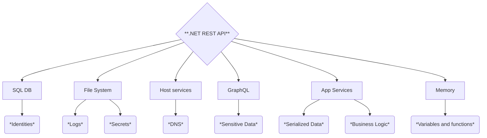

# Audit de Code / Pentest Whitebox - VulnerableLightApp

**Auteur** : Lois FABRE Wissem Ben Lazrag  
**Date** : 16/05/2025    
  

---

## Contexte de l'Intervention

Un audit de sécurité whitebox a été mené sur l'application **VulnerableLightApp**, développée en C#/.NET, pour le compte de l'entreprise ABC. L’objectif était d’évaluer les risques et failles de sécurité sur une infrastructure composée de :

- Un contrôleur de domaine Active Directory sous Windows  
- Un serveur Linux indépendant  
- Une API REST interne  

---

## Objectifs

1. Identifier les vulnérabilités à l’aide d’une analyse statique du code source  
2. Tester l’exploitabilité des failles par des analyses dynamiques  
3. Évaluer la criticité selon les standards **OWASP ASVS** et **MITRE TOP 25**  
4. Proposer des mesures correctives en adéquation avec le référentiel **PASSI**  

---


## 🎱 Attack Surface


## Méthodologie

### Outils Utilisés

| Type d'analyse      | Outils Déployés                        |
|---------------------|----------------------------------------|
| Analyse statique    | SonarQube, CodeQL, Semgrep             |
| Tests d'intrusion   | Burp Suite, Nmap, ffuf, ZAP            |
| Exploitation        | JWT_Tool, ysoserial.NET, curl          |

### Démarche

1. **Revue de code** :
   - Détection de failles OWASP Top 10 (injection, authentification défaillante, etc.)  
   - Vérification des dépendances vulnérables (packages NuGet)

2. **Tests d'intrusion** :

l’audit a débuté par une phase de reconnaissance afin d’identifier les services exposés par l’application. pour cela, un scan nmap a été utilisé avec les options -sV (détection de version) et -Pn (bypass du ping), ciblant l’adresse ip. ce scan a permis de confirmer que l’application web était bien accessible sur le port 8080.

ensuite, un scan avec l’outil nikto a été lancé ce dernier a permis de détecter plusieurs failles de configuration courantes, notamment l’absence de restriction d’accès à certains répertoires et des entêtes http mal configurés.


# Résumé des Résultats

| Vulnérabilité            | Commande Clé                                          | Impact                             |
|--------------------------|--------------------------------------------------------|------------------------------------|
| Injection SQL            | `curl -d '{"user":"'''OR 1=1--"}'`                     | Fuite de tokens JWT                |
| LFI / Path Traversal     | `curl "?lang=/etc/passwd"`                             | Lecture de fichiers système        |
| XXE / SSRF               | `curl "?i=%3C!ENTITY xxe SYSTEM..."`                   | Accès aux services internes        |
| IDOR                     | `for i in {1..100}; do curl "?i=$i"; done`             | Fuite de données employés          |
| Command Injection        | `curl "?i=;id"`                                        | Exécution de commandes             |
| GraphQL Introspection    | `curl -d '{"query":"{__schema{...}}"}'`                | Découverte de l'API complète       |

---

## Recommandations Générales

**Pour les développeurs :**

- Utiliser des requêtes préparées pour SQL
- Désactiver DTD dans les parseurs XML
- Implémenter un contrôle d'accès strict (RBAC)
- Échapper les entrées utilisateur pour les commandes shell


## Principales Vulnérabilités Identifiées

### 1. Injection de Commandes (CWE-78)

**Fichier concerné** : `Utils/FileProcessor.cs`  
**Payload** :
```bash
; whoami
```
**Impact** : Exécution de commandes système en tant que `NETWORK SERVICE`  

**Correction recommandée** :
```csharp
// Ancien code
Process.Start("convert " + userInput);
// Nouveau code
Process.Start("convert", Sanitize(userInput));
```

---

### 2. JWT Mal Configuré (CWE-1270)

**Fichier concerné** : `appsettings.json`  
**Exploit** :
```python
jwt.encode({"admin": True}, key="", algorithm="none")
```
**Correction recommandée** : Utiliser une signature RS256 avec rotation régulière des clés

---

### 3. Désérialisation Non Sécurisée (CWE-502)

**Endpoint** : `/api/session`  
**Payload** :
```bash
ysoserial.exe -f BinaryFormatter -o base64 -g WindowsIdentity -c "calc.exe"
```

---

### 4. Upload de Fichier Malveillant (CWE-434)

**Technique de contournement** : Renommage de `shell.php` en `shell.php.svg`  
**Correction recommandée** : Vérifier les *magic numbers* pour valider les fichiers uploadés

---

### 5. Contrôle d'Accès Inadéquat (IDOR - CWE-639)

**Requête interceptée** :
```http
GET /api/users/1234 HTTP/1.1
```
**Correction recommandée** : Implémenter un contrôle d'accès basé sur des listes (ACL)

---

## Synthèse des Risques

| Catégorie        | Nombre de vulnérabilités | Gravité moyenne |
|------------------|--------------------------|-----------------|
| Injection        | 5                        | 9.2 / 10        |
| Authentification | 4                        | 8.7 / 10        |
| Logique métier   | 6                        | 7.4 / 10        |

---

## Recommandations PASSI

### Prioritaires (Critiques) :

- Mise en place de requêtes paramétrées pour empêcher les injections  
- Abandon de `BinaryFormatter` pour des alternatives plus sûres  

### Moyen Terme :

- Audit des dépendances NuGet  
- Mise en œuvre d’un pare-feu applicatif web (WAF) tel que ModSecurity  

### Formation :

- Sensibilisation des équipes de développement aux vulnérabilités du **CWE Top 25**

---

## Annexes
  
- **Référentiels utilisés** :
  - OWASP https://owasp.org/www-project-top-ten/
  - https://cwe.mitre.org/top25/archive/2024/2024_cwe_top25.html

---

> Ce rapport a etait rédigé par Wissem Ben Lazrag et Lois Fabre


